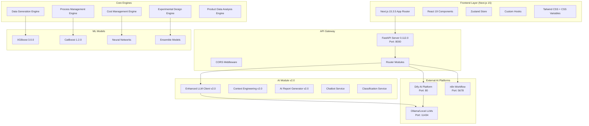
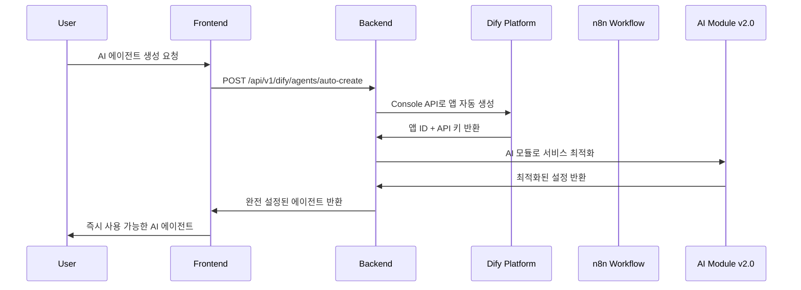

# DX-AI Manufacturing Copilot

> 🏭 **스마트 제조 공정 관리를 위한 AI 솔루션**
> 
> 제조업의 디지털 전환을 위한 종합 AI 플랫폼으로, 데이터 생성부터 공정 최적화, 비용 관리까지 전 과정을 지원합니다.


## 📋 목차

- [개요](#개요)
- [주요 신기능 (v2.0)](#주요-신기능-v20)
- [아키텍처](#아키텍처)
- [프로젝트 구조](#프로젝트-구조)
- [기술 스택](#기술-스택)
- [핵심 기능](#핵심-기능)
- [설치 및 실행](#설치-및-실행)
- [환경 설정](#환경-설정)
- [API 문서](#api-문서)
- [개발 가이드](#개발-가이드)
- [향후 개발 계획](#향후-개발-계획)
- [릴리스 노트](#릴리스-노트)

## 🎯 개요

DX-AI Manufacturing Copilot은 제조업체의 디지털 전환을 위한 통합 AI 플랫폼입니다. **Next.js 15 + React 19 Frontend**와 **FastAPI Backend**, **AI 모듈 v2.0**, **Dify AI Platform** 통합으로 구성되어 LangChain/LangGraph 기반의 고급 AI 에이전트와 자동화된 AI 서비스 생성을 통해 더욱 지능적인 제조 솔루션을 제공합니다.

**현재 구현된 9개 모듈**과 **향후 개발 예정인 6개 IoT/GenAI 모듈**을 통해 총 **15개의 전문 기능**을 제공하는 엔터프라이즈급 제조 솔루션입니다.

### 🌟 주요 특징

- **🚀 Next.js 15 + React 19**: Turbopack 기반 최신 프론트엔드 스택
- **⚡ FastAPI + Python 3.11+**: 고성능 비동기 백엔드 API
- **🤖 AI 모듈 v2.0**: LangChain/LangGraph 기반 지능형 AI 에이전트 시스템
- **🎯 Dify AI Platform**: 자동 AI 에이전트 생성 및 관리 시스템
- **🔧 n8n 워크플로우**: 시각적 자동화 워크플로우 시스템
- **🎨 완전한 테마 시스템**: CSS 변수 기반 다크/라이트 테마
- **🔧 통합 아이콘 시스템**: Lucide Icons 기반 42개 SVG 아이콘
- **📊 실시간 데이터 처리**: 비동기 스트리밍 및 실시간 업데이트
- **🔒 타입 안전성**: TypeScript 완전 적용으로 런타임 오류 최소화

## 🆕 주요 신기능 (v2.0)

### 🎯 Dify AI Platform 통합
- **완전 자동 AI 에이전트 생성**: 템플릿 기반 원클릭 에이전트 생성
- **Console API 통합**: Dify Console API를 통한 완전 자동화
- **폴백 모드**: API 키 미설정시 수동 모드로 자동 전환
- **다양한 에이전트 템플릿**: 제조업 전문 AI 에이전트 템플릿 제공

### 🔧 독립적 서비스 아키텍처
- **모듈화된 Docker 서비스**: n8n, Dify 각각 독립 관리
- **통합 시작 스크립트**: `start-services.sh`로 모든 서비스 일괄 시작
- **서비스별 헬스체크**: 각 서비스 상태 독립 모니터링

### 🤖 AI 모듈 v2.0 완전 구현
- **완전한 LangChain/LangGraph 지원**: 최신 AI 프레임워크 완전 활용
- **컨텍스트 엔지니어링 v2.0**: 질문 유형 분석 및 서비스별 특화
- **서비스별 최적화 클라이언트**: 챗봇, 분류, 보고서별 최적화
- **비동기 처리**: 대용량 AI 작업 백그라운드 처리

## 🏗️ 아키텍처

### 전체 시스템 아키텍처 (v2.0)



### 서비스 간 통신 흐름 (v2.0)



## 📁 프로젝트 구조

```
epm/
├── 📱 frontend/                    # Next.js 15 + React 19 웹 애플리케이션
│   ├── src/
│   │   ├── app/                   # App Router (Next.js 15)
│   │   │   ├── copilot/          # AI Copilot 기능 페이지들
│   │   │   │   ├── ai-agent/          # 🆕 AI 에이전트 관리 페이지
│   │   │   │   ├── dify-service/      # 🆕 Dify 서비스 관리 페이지
│   │   │   │   ├── data-generation/    # 데이터 생성 페이지
│   │   │   │   ├── experiment-design/  # 실험 설계 페이지
│   │   │   │   ├── product-modeling/   # 제품 모델링 페이지
│   │   │   │   ├── product-data-analysis/ # 제품 데이터 분석 페이지
│   │   │   │   ├── process-analysis/   # 공정 분석 페이지
│   │   │   │   ├── cost-management/    # 비용 관리 페이지
│   │   │   │   ├── workflow/           # n8n 워크플로우 페이지
│   │   │   │   └── ai-report/          # AI 보고서 페이지
│   │   │   ├── layout.tsx        # 루트 레이아웃
│   │   │   └── page.tsx          # 랜딩 페이지
│   │   ├── components/            # React 19 컴포넌트
│   │   │   ├── Navigation.tsx     # 네비게이션 바
│   │   │   ├── Sidebar.tsx        # 사이드바
│   │   │   ├── ThemeProvider.tsx  # 테마 시스템 (CSS Variables)
│   │   │   ├── FloatingChatbot.tsx # 플로팅 챗봇
│   │   │   ├── MarkdownRenderer.tsx # 마크다운 렌더러
│   │   │   └── ui/               # 재사용 가능한 UI 컴포넌트
│   │   ├── hooks/                # 커스텀 React 훅
│   │   │   ├── useApi.ts         # API 호출 훅
│   │   │   ├── useChatbot.ts     # 챗봇 훅
│   │   │   ├── useDify.ts        # 🆕 Dify 플랫폼 훅
│   │   │   ├── useExperimentDesign.ts # 실험 설계 훅
│   │   │   ├── useTranslation.ts # 다국어 지원
│   │   │   └── useWorkflow.ts    # 워크플로우 훅
│   │   ├── types/                # TypeScript 타입 정의
│   │   │   ├── api.ts            # API 타입 정의
│   │   │   ├── dify.ts           # 🆕 Dify 타입 정의
│   │   │   ├── index.ts          # 공통 타입
│   │   │   └── settings.ts       # 설정 타입
│   │   └── locales/              # 다국어 번역
│   ├── public/                   # 정적 자산
│   │   ├── icons/               # Lucide 아이콘 SVG (42개)
│   │   └── fonts/               # Paperlogy 폰트
│   └── package.json             # Next.js 15, React 19 의존성
│
├── 🚀 backend/                     # FastAPI 백엔드 서버
│   ├── src/
│   │   ├── ai/                   # 🤖 AI 모듈 v2.0 (완전 구현)
│   │   │   ├── core/            # 핵심 AI 기능
│   │   │   │   ├── llm_client.py         # Enhanced LLM 클라이언트 v2.0
│   │   │   │   ├── context_engineering.py # 컨텍스트 엔지니어링 v2.0
│   │   │   │   ├── ai_report_generator.py # AI 보고서 생성기 v2.0
│   │   │   │   └── base.py               # BaseAIService
│   │   │   ├── chatbot/         # 챗봇 서비스
│   │   │   │   ├── service.py   # ChatbotService (LangGraph)
│   │   │   │   └── models.py    # 챗봇 데이터 모델
│   │   │   ├── classification/  # 분류 서비스
│   │   │   │   ├── service.py   # ClassificationService
│   │   │   │   └── models.py    # 분류 데이터 모델
│   │   │   ├── report/          # 도메인별 보고서 생성
│   │   │   │   └── experimental_design_report_generator.py
│   │   │   ├── providers/       # AI 제공자 추상화
│   │   │   │   └── ollama.py    # Ollama 제공자
│   │   │   └── demo.py         # AI 모듈 종합 데모 v2.0
│   │   ├── core/                 # 핵심 비즈니스 로직
│   │   │   ├── data_generation_engine.py  # 데이터 생성 엔진
│   │   │   ├── experimental_design_engine.py # 실험 설계 엔진
│   │   │   ├── process_management_engine.py  # 공정 관리 엔진
│   │   │   ├── product_data_analysis_engine.py # 제품 데이터 분석 엔진
│   │   │   ├── cost_management_engine.py     # 비용 관리 엔진
│   │   │   ├── cost_optimization_engine.py  # 비용 최적화 엔진
│   │   │   ├── advanced_optimization.py     # 고급 최적화
│   │   │   ├── config.py                    # 설정 관리
│   │   │   └── data_models.py               # 데이터 모델
│   │   ├── ml_models/            # 머신러닝 모델들
│   │   │   ├── xgboost_model.py
│   │   │   ├── catboost_model.py
│   │   │   ├── neural_network.py
│   │   │   ├── random_forest.py
│   │   │   ├── svr_model.py
│   │   │   └── model_manager.py
│   │   ├── utils/                # 유틸리티 함수들
│   │   │   ├── data_utils.py
│   │   │   ├── experimental_design_utils.py
│   │   │   └── cost_management_utils.py
│   │   └── pages/                # Streamlit 페이지들 (레거시)
│   ├── routers/                  # FastAPI 라우터들
│   │   ├── chatbot.py           # 챗봇 API 라우터
│   │   ├── dify_agent.py        # 🆕 Dify AI 에이전트 API 라우터
│   │   ├── experimental_design.py # 실험 설계 API 라우터
│   │   └── workflow.py          # 워크플로우 API 라우터
│   ├── main.py                   # FastAPI 앱 진입점
│   ├── pyproject.toml           # Python 의존성 (Poetry)
│   └── .env                     # 환경 변수
│
├── 🤖 dify/                       # 🆕 Dify AI Platform
│   └── docker-compose.yml        # Dify 서비스 설정
│
├── 🔧 n8n/                        # 🆕 n8n 워크플로우 자동화
│   ├── docker-compose.yml        # n8n 서비스 설정
│   └── data/                     # n8n 워크플로우 데이터
│
├── 📊 streamlit_epm/              # Streamlit 웹 앱 (레거시)
├── 🔍 streamlit_iot_prism/        # IoT 데이터 분석 도구
├── 🆕 SETUP_GUIDE.md             # 완전한 설치 가이드
├── 🆕 SERVICES_ARCHITECTURE.md    # 서비스 아키텍처 문서
├── 🆕 start-services.sh           # 통합 서비스 시작 스크립트
└── 🚀 향후 개발 모듈들/
    ├── 🌐 iot_prism_advanced/    # IoT Prism - 고급 시각화 분석
    ├── 🔬 iot_algorithm_ml/      # IoT Algorithm - ML/시뮬레이션
    ├── ⚡ iot_predictive_coding/  # IoT 실시간 이상 감지
    ├── 📊 idsb_dashboard/        # iDSB - GenAI 대화형 대시보드
    ├── 🎓 ai_advisor_rag/        # AI Advisor - RAG 전문가
    └── 📈 dpp_planning/          # DPP - 동적 생산 계획
```

## 🛠 기술 스택

### Frontend Tech Stack (v2.0)

```json
{
  "core": {
    "framework": "Next.js 15.3.5",
    "react": "React 19.0.0",
    "typescript": "TypeScript 5.x",
    "buildTool": "Turbopack"
  },
  "styling": {
    "framework": "Tailwind CSS 3.4.17",
    "methodology": "CSS Variables + utility-first",
    "themes": "Dark/Light mode support",
    "icons": "Lucide React 0.525.0 (42 SVG icons)"
  },
  "stateManagement": {
    "global": "Zustand 5.0.6",
    "networking": "Axios 1.10.0"
  },
  "ui_components": {
    "utilities": "class-variance-authority 0.7.1, clsx 2.1.1",
    "markdown": "react-markdown 10.1.0, remark-gfm 4.0.1",
    "syntax": "rehype-highlight 7.0.2, prism-themes 1.9.0"
  }
}
```

### Backend Tech Stack (v2.0)

```python
{
  "core": {
    "framework": "FastAPI 0.112.0",
    "python": "Python 3.11+",
    "server": "Uvicorn 0.30.0",
    "async": "asyncio, async/await"
  },
  "ai_ml": {
    "llm_framework": "LangChain 0.3.26",
    "workflow_engine": "LangGraph 0.5.0",
    "transformers": "Transformers 4.53.0",
    "embeddings": "Sentence-Transformers 4.1.0",
    "vector_store": "FAISS-CPU 1.11.0",
    "ml_models": [
      "scikit-learn 1.5.2",
      "XGBoost 3.0.0", 
      "CatBoost 1.2.0",
      "PyTorch 2.7.1"
    ]
  },
  "llm_providers": {
    "local": "Ollama (Gemma3 models)",
    "commercial": [
      "OpenAI GPT (via LangChain-OpenAI 0.3.27)",
      "Google Gemini (via LangChain-Google-GenAI 2.1.6)",
      "HuggingFace (via LangChain-HuggingFace 0.3.0)"
    ]
  },
  "data_processing": {
    "dataframes": "pandas 2.3.0",
    "numerical": "numpy 2.3.1",
    "visualization": "matplotlib 3.10.3, plotly 6.2.0",
    "statistics": "scipy 1.11.4"
  },
  "optimization": {
    "hyperparameter": "scikit-optimize 0.10.1",
    "experiment_design": "pyDOE2 1.3.0",
    "mathematical": "pyomo 6.7.0"
  },
  "data_validation": {
    "models": "Pydantic 2.8.0",
    "settings": "Pydantic-Settings 2.6.0"
  }
}
```

## 🌟 핵심 기능

### 1. 🎯 AI 에이전트 관리 (신규)
- **자동 에이전트 생성**: 템플릿 기반 원클릭 AI 에이전트 생성
- **Dify 플랫폼 통합**: Console API를 통한 완전 자동화
- **제조업 특화 템플릿**: 9개 도메인별 전문 AI 에이전트
- **폴백 시스템**: API 키 미설정시 수동 모드 자동 전환

### 2. 🔧 Dify 서비스 관리 (신규)
- **다중 서비스 관리**: 여러 Dify 인스턴스 통합 관리
- **실시간 연결 테스트**: 서비스 상태 실시간 모니터링
- **앱 생성 및 관리**: Dify 앱 생명주기 관리

### 3. 🔬 데이터 생성 (Data Generation)
- **시뮬레이션 기반 데이터 생성**: 실제 제조 환경을 모사한 데이터 생성
- **실험 데이터 시뮬레이션**: DOE 기반 실험 데이터 자동 생성
- **원가 데이터 생성**: 생산 비용 시뮬레이션 데이터
- **다양한 분포 지원**: 정규분포, 균등분포, 로그정규분포 등

### 4. 📊 실험 설계 (Experimental Design)
- **DOE (Design of Experiments)**: 체계적인 실험 설계
- **다양한 실험 방법**: Full Factorial, Fractional Factorial, Latin Hypercube
- **통계적 분석**: ANOVA, 회귀분석, 반응표면법
- **AI 기반 실험 계획**: LangGraph 기반 지능형 실험 설계

### 5. 🤖 제품 모델링 (Product Modeling)  
- **머신러닝 모델**: XGBoost 3.0, CatBoost 1.2, Random Forest, Neural Network
- **모델 앙상블**: 여러 모델의 조합으로 예측 정확도 향상
- **하이퍼파라미터 최적화**: Bayesian Optimization 기반 자동 튜닝
- **실시간 예측**: 생산 중 품질 예측 및 알림

### 6. ⚡ 공정 분석 (Process Analysis)
- **실시간 모니터링**: 생산 공정의 실시간 상태 추적
- **이상 탐지**: 통계적 방법과 ML 기반 이상치 감지
- **성능 지표 분석**: OEE, 수율, 품질 지표 분석  
- **설비 상태 모니터링**: 장비별 성능 및 상태 추적

### 7. 💰 비용 관리 (Cost Management)
- **비용 최적화**: 생산 비용 최소화를 위한 최적화 알고리즘
- **비용 예측**: 시계열 분석 기반 비용 예측
- **ROI 분석**: 투자 수익률 분석 및 시나리오 플래닝
- **원가 구조 분석**: 상세한 비용 구성 요소 분석

### 8. 📑 AI 보고서 (AI Report) - v2.0
- **LangGraph 워크플로우**: 복잡한 보고서 생성 파이프라인 완전 구현
- **자동 리포트 생성**: LLM 기반 분석 리포트 자동 생성  
- **컨텍스트 향상**: Context Engineering을 통한 품질 개선
- **다양한 포맷 지원**: PDF, Excel, PowerPoint 형식 지원
- **비동기 처리**: 대용량 보고서 백그라운드 생성

### 9. 🔄 워크플로우 (Workflow)
- **n8n 통합**: 시각적 워크플로우 편집기 연동
- **자동화**: 반복 작업 자동화 및 스케줄링
- **API 연동**: 외부 시스템과의 데이터 연동
- **트리거 기반**: 이벤트 기반 자동 실행

## 🚀 설치 및 실행

> 📖 **완전한 설정 가이드**: **[SETUP_GUIDE.md](./SETUP_GUIDE.md)** - n8n, Dify 포함 전체 시스템 설치부터 실제 사용까지 단계별 가이드

### ⚡ 빠른 시작

```bash
# 1. 프로젝트 클론
git clone [your-repository-url] && cd epm

# 2. 전체 시스템 시작 (한 번에)
chmod +x start-services.sh && ./start-services.sh

# 3. 백엔드 시작 (새 터미널)
cd backend && python main.py

# 4. 프론트엔드 시작 (새 터미널)
cd frontend && npm install && npm run dev
```

### 🎯 접속 정보
| 서비스 | URL | 설명 |
|--------|-----|------|
| **Frontend** | http://localhost:3000 | 메인 웹 인터페이스 |
| **Backend API** | http://localhost:8000/docs | API 문서 |
| **Dify Console** | http://localhost | AI 에이전트 관리 |
| **n8n Workflow** | http://localhost:5678 | 워크플로우 자동화 |

### 📚 문서
- **[SETUP_GUIDE.md](./SETUP_GUIDE.md)** - 🆕 **완전 설정 가이드** (설치부터 사용까지)
- **[SERVICES_ARCHITECTURE.md](./SERVICES_ARCHITECTURE.md)** - 개발자 아키텍처 가이드

## 🔧 환경 설정

### 필수 환경 변수

#### Backend (.env)
```env
# Dify AI Platform 설정 (자동 에이전트 생성용)
DIFY_CONSOLE_API_KEY=your_console_api_key_here
DIFY_API_URL=http://localhost/console/api

# AI 모듈 v2.0 설정
OLLAMA_BASE_URL=http://localhost:11434
OLLAMA_MODEL=gemma2:2b
OLLAMA_TIMEOUT=300

# LangChain 설정
LANGCHAIN_CACHE_ENABLED=true
LANGCHAIN_VERBOSE=false

# 외부 AI 서비스 (선택사항)
OPENAI_API_KEY=your_openai_api_key
GOOGLE_API_KEY=your_google_api_key
HUGGINGFACE_API_KEY=your_huggingface_api_key
```

#### Frontend (.env.local)
```env
NEXT_PUBLIC_API_URL=http://localhost:8000
NEXT_PUBLIC_APP_NAME=DX-AI Manufacturing Copilot
```

### Dify Console API 키 설정

자동 AI 에이전트 생성을 위해 Dify Console API 키가 필요합니다:

1. **Dify 서비스 시작**: `cd dify && docker-compose up -d`
2. **Dify Console 접속**: http://localhost
3. **API 키 생성**: Settings → API Keys → Create API Key (Console API 선택)
4. **환경변수 설정**: `export DIFY_CONSOLE_API_KEY=your_key`
5. **Backend 재시작**: API 키 적용

## 📚 API 문서

### 주요 API 엔드포인트 (v2.0)

#### Dify AI 에이전트 API

```http
# 자동 AI 에이전트 생성
POST /api/v1/dify/agents/auto-create/{template_id}
Content-Type: application/json

{
  "name": "제조 공정 최적화 전문가",
  "description": "생산 라인 최적화 전문 AI 상담원"
}

# 응답 예시 (성공)
{
  "success": true,
  "ready_to_use": true,
  "auto_created": true,
  "agent": {
    "id": "agent_123",
    "name": "제조 공정 최적화 전문가",
    "status": "active",
    "dify_app_id": "app_456",
    "api_key": "app-xxx"
  }
}

# 응답 예시 (폴백 모드)
{
  "success": true,
  "ready_to_use": false,
  "fallback_mode": true,
  "setup_required": true,
  "setup_instructions": [
    "1. Dify 콘솔에서 수동으로 앱을 생성하세요",
    "2. 생성된 앱의 API 키를 복사하세요",
    "3. 에이전트 설정에서 API 키를 입력하세요"
  ]
}
```

#### AI 모듈 v2.0 API

```http
# AI 보고서 생성 (v2.0)
POST /api/report/generate
Content-Type: application/json

{
  "data_sources": ["production_data", "quality_logs"],
  "report_type": "comprehensive_analysis",
  "enhancement_enabled": true,
  "async_mode": true,
  "use_context_engineering": true
}
```

#### 챗봇 API (스트리밍)

```http
# AI 전문가 상담 (스트리밍)
POST /api/v1/chatbot/chat/stream
Content-Type: application/json

{
  "message": "압출성형 공정에서 온도 불균일 문제를 해결하는 방법은?",
  "session_id": "session_123",
  "user_id": "user_456",
  "topic": "process_analysis"
}
```

### 상세 API 문서
- **Interactive API Docs**: http://localhost:8000/docs
- **ReDoc**: http://localhost:8000/redoc  
- **OpenAPI Schema**: http://localhost:8000/openapi.json

## 👨‍💻 개발 가이드

### 프론트엔드 개발

```bash
# 개발 서버 시작 (Turbopack)
cd frontend && npm run dev

# 타입 체크
npm run type-check

# 린트 검사
npm run lint
```

### 백엔드 개발

```bash
# Poetry 가상환경 활성화
cd backend && poetry shell

# 개발 서버 시작
python main.py

# 테스트 실행
poetry run pytest

# 코드 포맷팅
poetry run black .
poetry run isort .
```

### AI 모듈 개발 (v2.0)

```python
# AI 클라이언트 사용 예시
from src.ai import get_chatbot_client, get_report_client

# 챗봇용 클라이언트 (높은 창의성)
chatbot_client = get_chatbot_client()
response = await chatbot_client.agenerate("제조 공정 관련 질문")

# 보고서용 클라이언트 (균형잡힌 설정)
report_client = get_report_client()
report = await report_client.generate_report(data)
```

## 🚀 향후 개발 계획 (Roadmap)

#### 🌐 IoT Prism (Prism, 시각화/분석, grkim)
- **고급 시각화**: Three.js 기반 3D 데이터 시각화
- **실시간 대시보드**: WebSocket 기반 실시간 모니터링
- **고급 분석**: 시계열 예측, 이상 패턴 감지

#### 🔬 IoT Algorithm (설계/모델링, yongchul)
- **기계학습 시뮬레이션**: 생산 시나리오 시뮬레이션
- **디지털 트윈**: 실제 장비의 디지털 복제본
- **예측 모델링**: 장비 수명, 품질 예측

#### ⚡ Predictive Coding (ygw0616)
- **스트리밍 분석**: Predictive Code 기반 실시간 이상 탐지
- **Edge AI**: 현장 장비에서의 즉시 판단
- **자동 알림**: Slack, Teams 연동 알림 시스템

#### 📊 iDSB (CMMS, Context Engineering, hwangjunic)
- **자연어 쿼리**: "지난 주 불량률이 높았던 이유는?"
- **자동 인사이트**: AI가 발견한 패턴 자동 보고
- **대화형 차트**: 음성/텍스트로 차트 조작

#### 🎓 AI Advisor (jundong3722)
- **제조업 지식베이스**: 업계 표준, 규정, 베스트 프랙티스
- **문서 기반 상담**: PDF, 매뉴얼 기반 전문가 답변
- **학습 시스템**: 사용자 피드백으로 지속 개선

#### 📈 DPP (hrshin)
- **실시간 계획 조정**: 수요 변화에 따른 자동 계획 수정
- **제약 조건 최적화**: 자원, 시간, 비용 제약 고려
- **시나리오 플래닝**: 다양한 생산 시나리오 시뮬레이션


---

**© 2024 DX-AI Manufacturing Copilot Team. All rights reserved.**