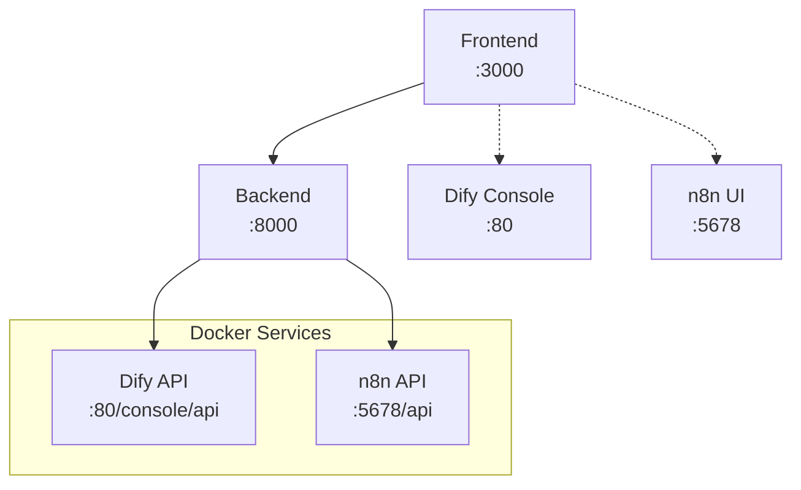

# DX-AI Manufacturing Copilot - 개발자 아키텍처 가이드

> 📖 **설치 및 사용법**: [SETUP_GUIDE.md](./SETUP_GUIDE.md) 참고

이 문서는 개발자를 위한 시스템 아키텍처 및 기술적 세부사항을 다룹니다.

## 📁 프로젝트 구조

```
epm/
├── 🚀 start-services.sh              # 전체 시스템 시작 스크립트
├── 🔧 n8n/                           # n8n 워크플로우 서비스
│   ├── docker-compose.yml            # n8n 전용 설정
│   └── data/                         # n8n 데이터 (gitignore)
├── 🤖 dify/                          # Dify AI Platform (gitignore)
│   └── docker/docker-compose.yml     # Dify 서비스 설정
├── 🖥️ backend/                       # FastAPI 백엔드
└── 🌐 frontend/                      # Next.js 프론트엔드
```

## 🔗 서비스 간 연동



## 💻 기술 스택

| 계층 | 기술 | 포트 | 역할 |
|------|------|------|------|
| **Frontend** | Next.js 15 + React 19 | 3000 | 사용자 인터페이스 |
| **Backend** | FastAPI + Python 3.11+ | 8000 | API 서버 |
| **AI Platform** | Dify (Docker) | 80 | AI 에이전트 관리 |
| **Workflow** | n8n (Docker) | 5678 | 워크플로우 자동화 |

## 🛠️ 주요 API 엔드포인트

### Backend API (http://localhost:8000)
```bash
# 시스템 상태 확인
curl http://localhost:8000/docs

# 워크플로우 관리
GET  /api/v1/workflow/workflows           # 워크플로우 목록
POST /api/v1/workflow/workflows/{id}/execute  # 워크플로우 실행
GET  /api/v1/workflow/executions         # 실행 기록

# Dify 연동
POST /api/v1/dify-agent/validate-key     # API 키 검증
POST /api/v1/dify-agent/send-message     # 메시지 전송
```

### n8n API (http://localhost:5678)
```bash
# 워크플로우 웹훅 (직접 호출 가능)
POST /webhook/test-webhook                # 테스트 웹훅
POST /webhook/manufacturing-data          # 제조 데이터 처리
POST /webhook/api-test                    # API 연동 테스트
```

### Dify API (http://localhost/console/api)
- Console API를 통한 AI 에이전트 관리
- 백엔드에서 프록시를 통해 접근

## 🏗️ 컨테이너 구성

### Dify AI Platform (10개 컨테이너)
- `dify-nginx-1`: 웹 서버 프록시
- `dify-api-1`: AI API 서버
- `dify-worker-1`: 백그라운드 작업 처리
- `dify-web-1`: 웹 인터페이스
- `dify-db-1`: PostgreSQL 데이터베이스
- `dify-redis-1`: 캐시 서버
- `dify-weaviate-1`: 벡터 데이터베이스
- `dify-sandbox-1`: 코드 실행 환경
- `dify-ssrf_proxy-1`: 보안 프록시
- `dify-plugin_daemon-1`: 플러그인 관리

### n8n Workflow (1개 컨테이너)
- `dx-ai-n8n-workflow`: 워크플로우 엔진

## 🔧 개발자 환경변수

```bash
# backend/.env
DIFY_API_URL=http://localhost/console/api
DIFY_CONSOLE_API_KEY=app-xxxxxxxxxx
N8N_API_URL=http://localhost:5678/api
N8N_API_KEY=n8n_xxxxxxxxxx
```

## 🎯 개발 가이드라인

- **Docker 우선**: 외부 서비스는 Docker로 관리
- **독립 실행**: Backend/Frontend는 직접 실행으로 개발 편의성 확보
- **환경 분리**: 각 서비스별 환경 설정 독립 관리
- **API 중심**: 서비스 간 통신은 REST API 사용 