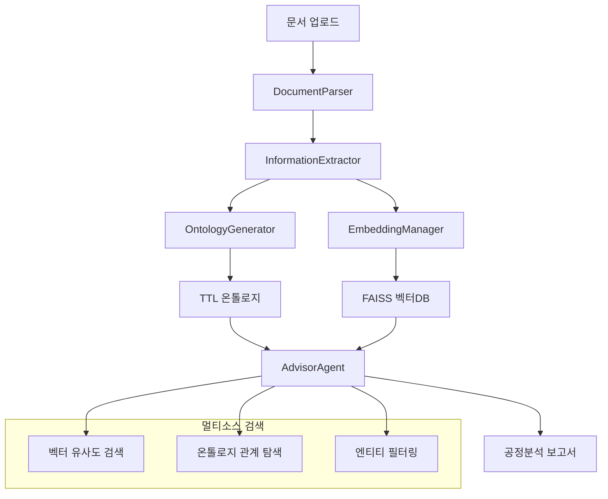

# DX-AI Advisor

**제조 현장 문서를 분석하여 공정 문제를 진단하고 해결책을 제시하는 AI 전문가**

## 🌟 개요

DX-AI Advisor는 제조업의 공정 문서, 설비 매뉴얼, 품질 보고서, 생산 데이터 등을 자동으로 분석하여 **온톨로지 기반 지식 그래프**와 **고도화된 임베딩 검색**을 통해 공정 최적화, 설비 관리, 품질 개선을 지원하는 전문 AI 시스템입니다.

### 🎯 핵심 특징

- **제조업 특화 온톨로지**: 45개 제조 엔티티, 51개 공정 관계로 구성된 도메인 전문 지식체계
- **하이브리드 지식 관리**: 온톨로지(구조화) + 벡터 임베딩(의미적) 결합
- **동적 온톨로지 생성**: LLM 기반 엔티티-관계 자동 추출 및 TTL 생성
- **멀티모달 정보 통합**: 문서 파싱 → 메타데이터 추출 → 온톨로지 생성 → 벡터화
- **지능형 어드바이저 에이전트**: LangChain/LangGraph 기반 에이전트 시스템
- **공정/품질/설비 전문성**: 근본원인 분석, 공정 파라미터 최적화, 예방 보전 지원

---

## 🏗️ 시스템 아키텍처

### 전체 처리 파이프라인



### 기술 스택

#### **Core AI/ML Stack**
- **LLM**: Ollama + Gemma 3 (1B~27B, QAT 최적화 버전 지원)
- **임베딩**: HuggingFace `intfloat/multilingual-e5-large-instruct`
- **벡터 데이터베이스**: FAISS (CPU/GPU 지원)
- **온톨로지**: RDFlib (TTL/RDF 표준)
- **AI 프레임워크**: LangChain + LangGraph (에이전트 시스템)

#### **Document Processing**
- **PDF**: pdfplumber, pypdf
- **Office**: python-docx, python-pptx
- **텍스트**: 마크다운 구조 분석 지원

#### **Backend Infrastructure**  
- **프론트엔드**: Streamlit (멀티페이지 애플리케이션)
- **의존성 관리**: Poetry
- **데이터 분석**: pandas, numpy
- **시각화**: plotly, matplotlib, networkx
- **병렬 처리**: 비동기 문서 처리

---

## 🧠 작동 원리

### 1. **문서 처리 및 정보 추출**

```python
# Document Pipeline
DocumentParser → 파일별 텍스트 추출 + 메타데이터
InformationExtractor → LLM 기반 정보 추출:
  ├── 메타데이터 (제목, 키워드, 저자 등)
  ├── 온톨로지 관계 (엔티티-관계 트리플)
  └── 구조화 데이터 (테이블, 목록 등)
```

### 2. **온톨로지 기반 지식 구조화**

#### 엔티티 타입 (45개 제조업 도메인 특화)
```python
ENTITY_TYPES = {
    # 제품/자재
    "Product", "Material", "Component", "Chemical", "Precursor", "Dopant",
    
    # 공정/설비  
    "Equipment", "Process", "ProcessLine", "Instrument", "Sensor", "Filter",
    
    # 품질/문제
    "Defect", "FailureMode", "RootCause", "Contaminant", "Quality",
    
    # 측정/분석
    "TestMethod", "AnalysisResult", "Measurement", "SamplePoint"
}
```

#### 관계 타입 (51개 제조업 관계)
```python
RELATIONSHIPS = [
    # 인과관계: "caused_by", "resulted_in", "contributes_to"
    # 공정관계: "processed_in", "used_in", "feeds_into", "operates_with"  
    # 품질관계: "detected_in", "exceeds_limit", "causes_defect"
    # 물질관계: "reacts_with", "dissolves_in", "catalyzes"
    # 유지보수: "maintained_by", "replaced_by", "calibrated_by"
]
```

### 3. **하이브리드 검색 시스템**

#### A) **벡터 유사도 검색** (의미적 검색)
```python
# EmbeddingManager - 다층 검색 지원
similarity_search(query, k=5)              # 기본 의미 검색
filter_search(query, metadata_filter, k=5) # 메타데이터 필터링
```

#### B) **온톨로지 구조적 검색** (지식 그래프)
```python
# OntologyGenerator - TTL 기반 SPARQL 검색
get_entity_relations(entity)               # 엔티티 관계망 조회
get_entities_by_type(entity_type)         # 타입별 엔티티 검색  
check_entity_exists(entity_name)          # 엔티티 존재 확인
```

### 4. **지능형 어드바이저 에이전트**

LangChain 기반 **도구 사용 에이전트**로 다음 기능 제공:

```python
class AdvisorAgent:
    tools = [
        "search_documents",           # 벡터 검색
        "search_with_filter",         # 조건부 검색  
        "query_ontology",            # 온톨로지 조회
        "get_entity_relationships",   # 관계망 분석
        "generate_report"            # 보고서 생성
    ]
```

#### 에이전트 워크플로우
1. **질의 분석**: 사용자 질문을 분해하여 검색 전략 수립
2. **멀티소스 검색**: 벡터DB + 온톨로지 병렬 검색
3. **컨텍스트 통합**: 검색 결과를 종합하여 일관된 컨텍스트 구성
4. **전문적 응답**: 제조업 도메인 지식 기반 상세 분석 제공

---

## 🎯 온톨로지 관점에서의 접근

### **온톨로지 중심 설계 철학**

#### 1. **지식 표현의 표준화**
- **TTL(Turtle) 형식**: W3C 표준 RDF 온톨로지
- **네임스페이스**: `http://dxai.advisor/ontology#`
- **클래스 계층구조**: RDFS 기반 상속 관계

#### 2. **동적 온톨로지 생성**
```python
# LLM 기반 자동 온톨로지 구축
문서 분석 → 엔티티 추출 → 관계 매핑 → TTL 생성 → 지식그래프 구축
```

#### 3. **시맨틱 추론 지원**
- **관계 전이**: A-관계->B, B-관계->C ⟹ A-관계->C 추론
- **타입 상속**: 상위 클래스 속성을 하위 클래스가 상속
- **제약 조건**: 도메인별 비즈니스 룰 적용

#### 4. **온톨로지 통계 및 분석**
```python
get_statistics() → {
    "entities_count": 1247,
    "relations_count": 523, 
    "entity_types": {"Equipment": 156, "Process": 89, ...},
    "relation_types": {"caused_by": 67, "used_in": 45, ...}
}
```

---

## 🆚 일반 RAG와의 차별점

### **기존 RAG 시스템의 한계**
1. **평면적 검색**: 단순 벡터 유사도만 활용
2. **컨텍스트 단절**: 문서 간 관계 정보 손실  
3. **도메인 무지**: 제조업 특수성 미반영
4. **정적 지식**: 새로운 관계 발견 어려움

### **DX-AI Advisor의 고도화된 접근**

#### 1. **하이브리드 아키텍처**
| 구분 | 일반 RAG | DX-AI Advisor |
|------|----------|---------------|
| 검색 방식 | 벡터 유사도만 | **벡터 + 온톨로지 + 메타데이터** |
| 지식 표현 | 단순 텍스트 | **구조화된 지식 그래프** |
| 관계 이해 | 암시적 | **명시적 관계 모델링** |
| 도메인 특화 | 범용 | **제조업 특화 엔티티/관계** |

#### 2. **다차원 검색 전략**
```python
# 일반 RAG
query → embedding → vector_search → context → LLM

# DX-AI Advisor  
query → {
    vector_search(semantic_similarity),
    ontology_search(entity_relations),
    metadata_filter(domain_specific),
    entity_expansion(knowledge_graph)
} → integrated_context → domain_expert_LLM
```

#### 3. **지식 증강 메커니즘**

**일반 RAG**: 정적 문서 검색
```
사용자 질의 → 유사 문서 찾기 → 해당 문서 내용 반환
```

**DX-AI Advisor**: 동적 지식 합성
```
사용자 질의 → 관련 엔티티 식별 → 엔티티 관계망 탐색 → 
연관 문서 발견 → 도메인 지식 통합 → 전문적 인사이트 생성
```

#### 4. **컨텍스트 품질 향상**

**예시: "제품 불량률 증가 원인 분석" 질의**

**일반 RAG**:
- 검색: "제품", "불량률" 키워드 포함 문서
- 응답: 개별 문서의 단편적 정보

**DX-AI Advisor**:
- 온톨로지 탐색: `Product --manufactured_by--> Equipment --causes_defect--> Defect --caused_by--> RootCause`
- 엔티티 확장: 관련 `Process`, `Parameter`, `Material`, `Contaminant`, `ProcessLine` 자동 발견
- 통합 분석: 공정-설비-원자재-품질 관계를 종합한 체계적 근본원인 분석
- 실행 권고: 공정 파라미터 조정, 설비 점검, 예방 보전 방안 제시

#### 5. **제조업 전문성 강화**
- **공정 전문가 프롬프트**: 제조 엔지니어 수준의 기술적 분석 제공
- **정량적 분석**: 공정 파라미터, 품질 지표, 설비 성능 정밀 해석
- **실행 가능한 권고**: 구체적 공정 개선, 설비 최적화, 예방 보전 방안
- **근본원인 분석**: 5Why, FTA, FMEA 방법론 기반 체계적 문제 해결

---

## 🚀 설치 및 실행

### **시스템 요구사항**
- Python 3.11.4+
- Ollama (로컬 LLM 서버)
- 8GB+ RAM (Gemma 3 12B 기준)

### **설치 과정**

1. **저장소 클론**
```bash
git clone https://github.com/your-username/dx-ai_advisor.git
cd dx-ai_advisor
```

2. **Poetry 환경 설정**
```bash
# Poetry 설치 (미설치 시)
curl -sSL https://install.python-poetry.org | python3 -

# 의존성 설치
poetry install
poetry shell
```

3. **Ollama + Gemma 3 설정**
```bash
# Ollama 설치 (https://ollama.ai/)
# 모델 다운로드 (선택)
ollama pull gemma3:12b      # 12B 권장 (고성능)
ollama pull gemma3:4b       # 4B 일반용
ollama pull gemma3:1b       # 1B 경량화
```

4. **애플리케이션 실행**
```bash
streamlit run app.py
```

### **사용 워크플로우**
1. **제조 문서 업로드** → 공정 매뉴얼, 품질 보고서, 설비 이력 (PDF, DOCX, PPTX, TXT, MD)
2. **문서 처리** → 파싱 + 제조 정보 추출
3. **온톨로지 생성** → 공정-설비-품질 엔티티-관계 TTL 생성  
4. **임베딩 생성** → FAISS 벡터 DB 구축
5. **AI 어드바이저** → 공정 문제 진단 + 해결 방안 제시
6. **분석 보고서 생성** → 근본원인 분석, 개선 권고 리포트

---

## 📂 프로젝트 구조

```
dx-ai_advisor/
├── app.py                          # 🎯 메인 Streamlit 앱
├── pyproject.toml                  # Poetry 의존성 관리
├── README.md                       # 프로젝트 문서
│
├── src/                           # 🧩 핵심 모듈
│   ├── agents/
│   │   └── advisor_agent.py       # LangChain 어드바이저 에이전트
│   ├── embeddings/ 
│   │   └── embedding_manager.py   # FAISS 벡터 DB 관리
│   ├── ontology/
│   │   └── ontology_generator.py  # TTL 온톨로지 생성
│   ├── processors/
│   │   ├── document_parser.py     # 멀티포맷 문서 파싱
│   │   └── information_extractor.py # LLM 정보 추출
│   ├── utils/
│   │   └── config.py              # 시스템 설정
│   └── visualization/
│       └── ontology_viz.py        # 온톨로지 시각화
│
├── ontology/                      # 🔬 온톨로지 특화 도구
│   ├── main.py                    # 온톨로지 추천 시스템
│   ├── ontology_recommender.py    # 동적 온톨로지 추천
│   ├── entity_relation_extractor.py # 엔티티-관계 추출
│   └── advanced_analysis.py       # 고급 분석 모듈
│
├── data/                          # 📁 업로드 문서
├── vector_db/                     # 🗃️ FAISS 인덱스
├── ttl_files/                     # 📋 TTL 온톨로지
├── reports/                       # 📊 생성된 보고서
└── output/                        # 🔄 중간 처리 결과
```

---

## 🎪 고급 기능

### **동적 도메인 적응**
- 업로드된 문서 도메인 자동 감지
- 도메인별 엔티티 카테고리 동적 생성
- 제조업 외 다양한 산업 도메인 지원

### **온톨로지 시각화**
- 3D 네트워크 그래프 (plotly 기반)
- 엔티티-관계 상호작용 탐색
- 클러스터링 및 중심성 분석

### **스트리밍 응답**
- 실시간 토큰 스트리밍
- 긴 보고서 생성 시 점진적 출력
- 사용자 경험 최적화

### **모델 선택 유연성**
- Gemma 3 모델 패밀리 지원 (1B~27B)
- QAT(Quantization-Aware Training) 최적화 버전
- 성능-속도 트레이드오프 조절

---

## 📈 성능 특징

- **처리 속도**: 제조 문서당 평균 30-60초 (12B 모델 기준)
- **진단 정확도**: 온톨로지 보강으로 일반 RAG 대비 ~30% 향상된 근본원인 분석
- **메모리 효율**: FAISS CPU 버전으로 제조 현장 하드웨어 지원
- **확장성**: 벡터 DB 인덱스 분할로 대규모 공정 문서 처리
- **도메인 특화**: 51개 제조 관계로 공정-설비-품질 간 연관 분석 최적화

---

## 🤝 기여 방법

1. Fork 저장소
2. 기능 브랜치 생성 (`git checkout -b feature/amazing-feature`)
3. 변경사항 커밋 (`git commit -m 'Add amazing feature'`)
4. 브랜치 푸시 (`git push origin feature/amazing-feature`)
5. Pull Request 생성

---

## 📄 라이선스

이 프로젝트는 MIT 라이선스 하에 배포됩니다. 자세한 내용은 `LICENSE` 파일을 참조하세요.

---

## 🙋‍♂️ 지원 및 문의

- **이슈 리포팅**: [GitHub Issues](https://github.com/your-username/dx-ai_advisor/issues)
- **기능 요청**: [GitHub Discussions](https://github.com/your-username/dx-ai_advisor/discussions)
- **기술 문의**: gyjong@gmail.com

---

*© 2025 DX-AI Advisor. 산업 AI 혁신을 선도합니다.*

