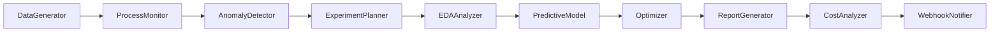

# DX-AI Manufacturing Copilot - Streamlit 기반 AI 솔루션

스마트 제조 공정 관리를 위한 AI 어시스턴트 솔루션 프로토타입입니다.

## 🎯 프로젝트 개요

본 프로젝트는 AI 에이전트와 RAG 기술을 활용하여 생산 공정의 효율성을 극대화하는 통합 솔루션을 제공합니다.

### 주요 모듈
- **가상 데이터 생성**: 생산·실험·원가 데이터 모사
- **프로세스 관리**: Lot 추적, 설비 가동·유지보수, 이상탐지
- **제품 개발**: 실험 시나리오 설계, EDA/상관분석, 예측 모델링
- **원가 관리**: 최적 투입량 계산, 비용 민감도 분석

### 기술 스택
- **Frontend**: Streamlit (멀티페이지 앱)
- **AI/ML**: LangChain, LangGraph, Ollama (gemma3:4b-it-qat)
- **Data**: pandas, NumPy, scikit-learn, FAISS
- **Optimization**: scikit-optimize, pyDOE2, Pyomo
- **API**: FastAPI (웹훅/알림)
- **의존성 관리**: Poetry

## 🚀 빠른 시작

### 1. 사전 요구사항
- Python 3.10+
- Poetry
- Ollama (gemma3:4b-it-qat 모델)

### 2. 설치
```bash
# 저장소 클론
git clone <repository-url>
cd epm

# Poetry로 의존성 설치
poetry install

# Ollama 모델 다운로드
ollama pull gemma3:4b-it-qat
```

### 3. 실행
```bash
# 가상환경 활성화 및 앱 실행
poetry run streamlit run app.py
```

브라우저에서 `http://localhost:8501` 접속

## 📁 프로젝트 구조

```
epm/
├── fonts/
│   └── Paperlogy.ttf          # 커스텀 폰트
├── ecopro_prototype/
│   ├── __init__.py
│   ├── core/                  # 핵심 기능
│   │   ├── config.py         # 설정 관리
│   │   ├── llm_client.py     # Ollama LLM 클라이언트
│   │   └── data_models.py    # 데이터 모델
│   ├── modules/               # 주요 모듈
│   │   ├── data_generator/   # 가상 데이터 생성
│   │   ├── process_manager/  # 프로세스 관리
│   │   ├── product_manager/  # 제품 개발
│   │   └── cost_manager/     # 원가 관리
│   ├── workflows/            # LangGraph 워크플로우
│   │   ├── agent_nodes.py    # 에이전트 노드들
│   │   └── workflow_graph.py # 메인 워크플로우
│   ├── utils/                # 유틸리티
│   │   ├── file_utils.py     # 파일 처리
│   │   ├── plot_utils.py     # 시각화
│   │   └── auth_utils.py     # 인증 (필요시)
│   └── api/                  # FastAPI 웹훅
│       ├── webhook_server.py # 웹훅 서버
│       └── notification.py   # 알림 시스템
├── pages/                    # Streamlit 페이지
│   ├── 1_🏠_홈.py
│   ├── 2_📊_데이터_생성.py
│   ├── 3_⚙️_프로세스_관리.py
│   ├── 4_🧪_제품_관리.py
│   └── 5_💰_원가_관리.py
├── .streamlit/
│   └── config.toml           # Streamlit 설정
├── data/                     # 데이터 저장소
├── tests/                    # 테스트 파일
├── app.py                    # 메인 앱 파일
├── pyproject.toml           # Poetry 설정
├── prd.md                   # 제품 요구사항 문서
└── README.md
```

## 🎨 주요 기능

### 1. 가상 데이터 생성
- 파라미터 기반 생산/실험 데이터 생성
- 노이즈 및 이상치 추가 옵션
- CSV 다운로드 지원

### 2. 프로세스 관리
- Lot별 원료·제품 투입 이력 추적
- 설비별 가동률·유지보수 일정 시각화
- 임계치 기반 이상탐지 및 알림
- RAG 기반 컨텍스트 검색

### 3. 제품 개발
- 실험 데이터 통합 뷰
- EDA 및 상관분석 히트맵
- 회귀/DNN 모델 기반 품질 예측
- DoE 및 Bayesian Optimization
- GenAI 실험 보고서 자동 생성

### 4. 원가 관리
- 생산 이력 학습 및 분석
- 품질 목표 기반 최적 투입량 예측
- SciPy/Pyomo 기반 비용 최적화
- LLM 기반 코스트 리포트 생성

## 🤖 AI 워크플로우 (LangGraph)



### 워크플로우 노드 설명
- **DataGenerator**: 가상 데이터 생성
- **ProcessMonitor**: Lot/설비 이력 대시보드
- **AnomalyDetector**: 임계치 기반 이상 탐지
- **ExperimentPlanner**: 실험 시나리오 추천
- **EDAAnalyzer**: 상관분석·데이터 시각화
- **PredictiveModel**: 품질 예측 모델
- **Optimizer**: DoE·Bayesian Optimization
- **ReportGenerator**: GenAI 보고서 생성
- **CostAnalyzer**: 비용 민감도 분석
- **WebhookNotifier**: 알림 API 호출

## 🔧 설정

### Streamlit 설정 (.streamlit/config.toml)
```toml
[theme]
base = "light"
primaryColor = "#1f77b4"
backgroundColor = "#ffffff"
secondaryBackgroundColor = "#f0f2f6"
textColor = "#262730"
font = "Paperlogy"

[server]
enableStaticServing = true
```

### 환경 변수
```bash
# Ollama 설정
OLLAMA_BASE_URL=http://localhost:11434
OLLAMA_MODEL=gemma3:4b-it-qat

# FastAPI 웹훅 설정  
WEBHOOK_URL=http://localhost:8000
WEBHOOK_SECRET=your-secret-key
```

## 📊 데모 실행 가이드

1. **DataGenerator** 탭에서 가상 데이터 생성 → CSV 다운로드
2. **ProcessMonitor** 탭에서 Lot/설비 이력 확인 → 이상탐지 알림 테스트
3. **ProductManager** 탭에서 EDA·예측모델 실행 → 실험 계획 보고서 생성
4. **CostManager** 탭에서 비용 최적화 시나리오 → LLM 코스트 리포트 확인

## 🧪 테스트

```bash
# 단위 테스트 실행
poetry run pytest tests/ -v

# 커버리지 포함 테스트
poetry run pytest tests/ --cov=manufacturing_copilot --cov-report=html
```

## 🤝 기여하기

1. Fork 프로젝트
2. Feature 브랜치 생성 (`git checkout -b feature/amazing-feature`)
3. 변경사항 커밋 (`git commit -m 'Add amazing feature'`)
4. 브랜치에 Push (`git push origin feature/amazing-feature`)
5. Pull Request 생성


## 📝 라이선스

This project is proprietary to DX-AI Manufacturing Copilot.

## 👥 팀

- **DX-AI Manufacturing Copilot Development Team**
- **AI/ML Engineering**
- **Process Engineering**
- **Cost Analysis**

---

📧 문의: support@manufacturing-copilot.com 