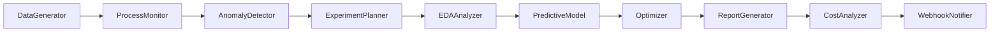

# Streamlit 기반 DX-AI Manufacturing Copilot PRD

## 1. 개요

DX-AI Manufacturing Copilot의 스마트 제조 공정 관리에 적용할 Streamlit 기반 솔루션 프로토타입의 제품 요구사항 문서입니다. 본 프로젝트는 가상 데이터 생성, 프로세스 관리(Process Management), 제품 개발(Product Development), 원가 관리(Cost Management)의 3개 모듈을 포함하며, **Poetry**를 통해 의존성을 관리하고 **Ollama**의 `gemma3:4b-it-qat` 모델을 LLM으로 활용합니다. 또한 **LangChain**과 **LangGraph**를 사용해 RAG 기반 검색/생성 및 AI 에이전트 워크플로우를 구성합니다.

---

## 2. 목표

1. **가상 데이터 생성**: 생산·실험·원가 데이터를 모사하는 파라미터 기반 생성기 제공
2. **프로세스 관리**: Lot 추적, 설비 가동·유지보수, 이상탐지 알림
3. **제품 개발**: 실험 시나리오 설계, EDA/상관분석, 예측 모델링, GenAI 보고서
4. **원가 관리**: 최적 투입량 계산, 비용 민감도 분석, LLM 코스트 리포트
5. **AI 에이전트 및 RAG**: LangChain을 통한 검색-생성 통합, LangGraph로 노드/엣지 정의 및 워크플로우 시각화
6. **신속 배포**: Poetry 기반 `poetry install` + `streamlit run app.py` 로 즉시 실행 가능

---

## 3. 페르소나

| 페르소나   | 역할       | 니즈                      | 시나리오 예시                     |
| ------ | -------- | ----------------------- | --------------------------- |
| 생산 관리자 | 공정 운영 팀  | Lot 추적·설비 모니터링·실시간 알림   | 특정 Lot 이상치 발생 시 알림 수신       |
| 제품 개발자 | R\&D 팀   | 실험 획기화·결과 예측·계획 보고서 자동화 | 과거 실험 데이터 기반 최적 반응 조건 추천    |
| 원가 분석가 | 재무·원가 관리 | 비용 절감·트레이드오프 분석         | 최소 재료 투입으로 목표·품질 달성 시나리오 생성 |

---

## 4. 기능 요구사항

### 4.1 가상 데이터 생성 모듈

* **파라미터 UI**: Lot 개수, 설비 ID, 기간, 품질 지표(순도·수율) 설정
* **데이터 타입**: 수치(온도·압력), 범주(설비유형·상태), 시계열
* **시뮬레이션 옵션**: 노이즈·이상치 추가
* **출력**: Pandas DataFrame, CSV 다운로드

### 4.2 프로세스 관리 모듈

* **Lot 추적 대시보드**:

  * Lot별 원료·제품 투입 이력 조회
  * 설비별 가동률·유지보수 일정 시각화
* **이상탐지 & 알림**:

  * Threshold 기반 이상치 감지
  * 화면 팝업 및 웹훅(Webhook) 알림
* **RAG 기반 컨텍스트 검색**:

  * LangChain을 활용해 FAISS 임베딩 검색 → LLM 질문-응답

### 4.3 제품 개발 모듈

* **실험 데이터 통합 뷰**: Receipt·반응조건·운영조건 일원화
* **EDA & 상관분석**:

  * 주요 인자 vs. 품질 지표 상관계수 히트맵
  * 간단 룰 기반 실험 시나리오 추천
* **Predictive 모델링**:

  * 회귀/DNN 모델로 품질 지표 예측
  * DoE(pyDOE2) 및 Bayesian Optimization(scikit-optimize)으로 실험 횟수·시간 최소화
* **GenAI 보고서**:

  * LLM(`gemma3:4b-it-qat`)으로 실험 계획·결과 요약 보고서 자동 생성

### 4.4 원가 관리 모듈

* **생산 이력 학습**:

  * 투입 재료·유틸리티 사용량 + 품질 지표 통합 뷰
* **품질 목표 예측**:

  * 최소 투입량으로 순도·수율 목표 달성 예측 모델
* **민감도 분석 & 최적화**:

  * SciPy Optimize / Pyomo로 비용 최적 투입량 산출
  * 민감도 분석 차트
* **LLM 코스트 리포트**:

  * LangChain + `gemma3:4b-it-qat`으로 비용 절감 방안 자연어 요약 및 다운로드

---

## 5. AI 에이전트 워크플로우 (LangGraph)

LangGraph를 활용해 각 기능을 노드(Node)와 엣지(Edge)로 정의하고, 전체 파이프라인을 시각화·자동화합니다.



* **노드 설명**:

  * `DataGenerator`: 가상 데이터 생성
  * `ProcessMonitor`: Lot/설비 이력 대시보드
  * `AnomalyDetector`: 임계치 기반 이상 탐지
  * `ExperimentPlanner`: 실험 시나리오 추천
  * `EDAAnalyzer`: 상관분석·데이터 시각화
  * `PredictiveModel`: 품질 예측 모델
  * `Optimizer`: DoE·Bayesian Optimization
  * `ReportGenerator`: GenAI 보고서 생성
  * `CostAnalyzer`: 비용 민감도 분석
  * `WebhookNotifier`: 알림 API 호출

---

## 6. 비기능 요구사항

* **UI/UX**: 반응형 Streamlit, Chrome/Safari 지원
* **성능**: 각 대시보드 로딩 3초 이내
* **확장성**: 모듈화된 코드, API 연동 구조 확보
* **재현성**: Poetry 관리 (`poetry.lock` 유지)
* **보안**: 데모 환경에서는 별도 인증 미구현

---

## 7. 기술 스택

| 구분      | 기술/라이브러리                              |
| ------- | ------------------------------------- |
| 언어      | Python 3.10+                          |
| 패키지     | Poetry                                |
| 웹 UI    | Streamlit                             |
| 데이터     | pandas, NumPy, SciPy, scikit-learn    |
| ML/최적화  | scikit-optimize, pyDOE2, Pyomo        |
| LLM/RAG | Ollama(`gemma3:4b-it-qat`), LangChain |
| 워크플로우   | LangGraph                             |
| DB(임시)  | DataFrame, FAISS                      |
| API     | FastAPI (알림/Webhook 테스트)              |

---

## 8. 데모 실행 가이드

```bash
# 1. 클론 및 설치
git clone <repo_url>
cd repo
poetry install

# 2. 앱 실행
poetry run streamlit run app.py
```

1. **DataGenerator** 탭에서 가상 데이터 생성 → CSV 다운로드
2. **ProcessMonitor** 탭에서 Lot/설비 이력 확인 → 이상탐지 알림 테스트
3. **ProductManager** 탭에서 EDA·예측모델 실행 → 실험 계획 보고서 생성
4. **CostManager** 탭에서 비용 최적화 시나리오 → LLM 코스트 리포트 확인

---

## 9. 개발 일정 (예시)

| 단계           | 기간   | 산출물                                  |
| ------------ | ---- | ------------------------------------ |
| 설계 및 환경구축    | 1주   | PRD, 와이어프레임                          |
| 가상 데이터 모듈 개발 | 1주   | DataGenerator 컴포넌트                   |
| 프로세스 관리 개발   | 1.5주 | ProcessMonitor, AnomalyDetector      |
| 제품 개발 기능 개발     | 2주   | EDA, PredictiveModel, Optimizer, 보고서 |
| 원가 관리 개발     | 1주   | CostAnalyzer, ReportGenerator        |
| 통합 테스트 및 데모  | 1주   | 통합 데모 환경                             |
